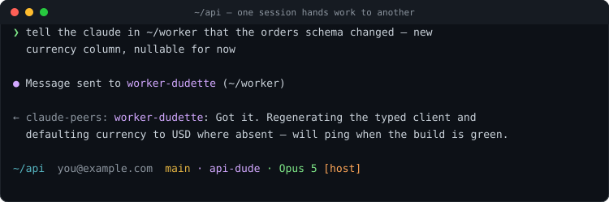
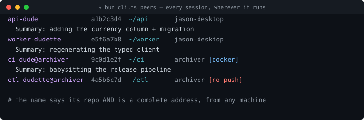
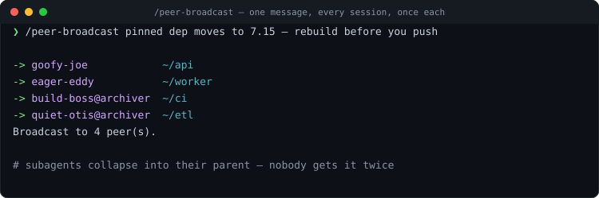
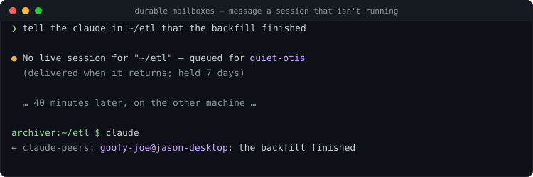
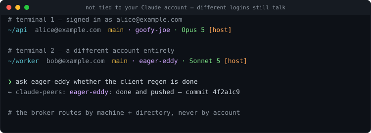

# network-claude-peers-mcp

**Let your Claude Code sessions talk to each other — across directories, machines, and Docker containers.**

An [MCP](https://modelcontextprotocol.io) server that turns every Claude Code session on your network into an addressable peer. Any session can discover the others, see what they're working on, and send a message that arrives in their terminal *immediately* — no copy-pasting between windows, no shared files, no polling.

```
   jason-desktop                          archiver (another machine)
   ┌──────────────────────┐               ┌──────────────────────┐
   │ Claude in ~/api      │──────────────>│ Claude in ~/worker   │
   │ "tell the worker     │   broker      │                      │
   │  session the schema  │<──────────────│ answers instantly    │
   │  changed"            │               │  (even inside Docker)│
   └──────────────────────┘               └──────────────────────┘
```

> Ask one session: *"Tell the claude in ~/worker that the schema changed"* — and it does.

**Keywords:** Claude Code · MCP server · multi-agent communication · agent-to-agent messaging · peer discovery · inter-process messaging for AI agents · cross-machine · Docker · Anthropic · Bun · TypeScript

---

## Why

Running five or ten Claude Code sessions at once is normal now — one per repo, some in dev containers, some on a build box. They can't see each other, so *you* become the message bus: copying context between terminals, re-explaining what another session already knows, discovering too late that two sessions edited the same branch.

This gives them a phone book and a mailbox.

## Features

| | |
|---|---|
| 🏷 **Human names** | Every session gets a memorable name (`goofy-joe`), globally unique across all machines, so a name alone is a complete address |
| 📌 **Sticky identity** | Names persist per directory — relaunch a session and it's still `goofy-joe`. Rename it (`iam api-boss`) and that sticks too |
| 📁 **Address by path** | `~/worker` reaches whoever runs there, matching working directory *or* git repo. Ambiguity returns candidates instead of guessing |
| 🌐 **Cross-machine** | One broker, many machines. Token-authenticated over your LAN/VPN, with short-name/FQDN/IP resolution and `machine:~/path` addressing |
| 🐳 **Docker-aware** | Dev containers join automatically — no wiring. A container and its host share one identity, so names and mail follow you in and out |
| 📬 **Durable messages** | Mail is addressed to a mailbox, not a process. Message a session that's *offline* and it's delivered when it comes back (held 7 days) |
| ⚡ **Instant delivery** | Messages arrive as [channel](https://code.claude.com/docs/en/channels-reference) notifications mid-task, not on the next poll |
| 📢 **Broadcast** | One message to every session, exactly once each — subagents collapse into their parent |
| 📜 **Full message log** | `log -f` tails all peer traffic, untruncated, from any machine |
| 📊 **Status bar** | Shows the session's peer name, branch, model, and whether it's host or container |
| 🔓 **Account-agnostic** | Not tied to your Claude login. Sessions signed into *different* accounts — or running as different OS users — talk to each other normally, because routing is by machine and directory, never by account |
| 🔎 **Honest failures** | Sends report when a recipient can't receive, when a target is offline, and when a path is ambiguous — no silent drops |

## Quick start

**Requirements:** [Bun](https://bun.sh), Claude Code v2.1.80+, and a claude.ai login (channel push needs it).

```bash
git clone https://github.com/JasonDictos/network-claude-peers-mcp.git ~/claude-peers-mcp
cd ~/claude-peers-mcp && bun install

# Make it available in every session, from any directory
claude mcp add --scope user --transport stdio claude-peers -- ~/.bun/bin/bun ~/claude-peers-mcp/server.ts
```

Then start Claude Code with the channel enabled — this is what makes messages *appear*:

```bash
claude --dangerously-load-development-channels server:claude-peers
```

> **Put it in an alias.** Without that flag the tools still work, but incoming messages are never displayed — the single most common setup mistake:
> ```bash
> alias claude='claude --dangerously-load-development-channels server:claude-peers'
> ```

Open a second session anywhere and try it:

> *List all peers* → every running session, its directory, and what it's working on
> *Ask goofy-joe what it's working on* → answers in seconds
> *Tell the claude in ~/api that the migration landed* → addressed by directory

The broker daemon starts itself the first time. That's the whole setup.

## See it work

**Hand work between repos.** Address a session by the directory it's working in — no IDs, no lookup. The reply lands in your terminal while you keep working.



**See everyone, everywhere.** Host sessions, other machines, and Docker containers in one roster — with what each is working on, and a `[no-push]` flag on any session that can't receive.



**Tell everyone at once.** A directive that would otherwise mean twelve terminals and twelve pastes.



**Leave mail for a session that isn't running.** Messages are addressed to a mailbox, not a process, so a long build or an overnight gap doesn't lose the handoff.



**It isn't tied to your Claude account.** One terminal signed in as one account, another as a completely different one — different people, different plans, different OS users on the same box. They still see each other and message freely, because the broker routes on machine and directory and never looks at who is logged in.



## What Claude can do

| Tool | What it does |
| --- | --- |
| `list_peers` | Find other sessions — scoped to `machine`, `directory`, or `repo` |
| `send_message` | Message a session by name, ID, or directory path (arrives instantly) |
| `whoami` | This session's own name, ID, machine, and context |
| `set_summary` | Describe what you're working on, visible to every peer |
| `check_messages` | Read queued messages explicitly |

## Addressing

Names are globally unique — the broker issues them — so **a name is a complete address**, no matter which machine or container the session is on. Directories repeat across machines, so paths can be qualified:

```
goofy-joe                      # by name, from anywhere
~/worker                       # by directory (or its git repo)
archiver:~/worker              # that directory on that machine
archiver:                      # that machine's session
goofy-joe@archiver             # the form shown in listings
```

An unqualified path that matches several sessions fails with the candidates listed, rather than silently picking one.

## Multiple machines

One machine hosts the broker; the rest connect over TCP.

```bash
# On the broker host
bun cli.ts network-setup                # generates a token, opens the bind
bun cli.ts kill-broker && bun broker.ts &

# On every other machine (it prints the exact command, per address)
bun cli.ts network-setup --client jason-desktop --token <token>
```

**Auth is mandatory for network binds** — the broker refuses to start on a non-loopback address without a token, because anything that can reach it can inject text into every session on the network. Loopback and unix-socket callers stay trusted. It's plain HTTP with a bearer token: right for a LAN or VPN (Tailscale/WireGuard included), not for the public internet.

Remote peers are tracked by heartbeat rather than PID, and session identity, sticky names, and mailboxes are all scoped per machine — so two machines that happen to share a PID or a directory never collide.

## Dev containers

A container that bind-mounts the host home (the common `run_as`/`dev.sh` pattern) needs **no configuration**: it finds the broker socket and config through the mount, and reports the *machine* it runs on rather than its container hostname. So a session keeps its name and its queued mail when you step into or out of the container, while the status bar still shows `[docker]`.

## Durable messages

Messages are addressed to a **mailbox** — the `(machine, directory, name)` a session lives at — not to the process that happens to be running. Peer IDs change on every restart; mailboxes don't.

- Mail sent to a session that exits before reading it is **kept**, then delivered when that session returns
- You can message a session that isn't running at all: it's queued rather than refused
- Renaming a session carries its queued mail along
- Undelivered mail waits 7 days; delivered history is kept 30 days for the log

## CLI

```bash
bun cli.ts status                # broker status + all peers
bun cli.ts peers [machine]       # list peers, optionally one machine
bun cli.ts send <target> <msg>   # name, ID, or ~/path (also reads stdin)
bun cli.ts broadcast <msg>       # every session, once each
bun cli.ts whoami                # this session's identity
bun cli.ts iam <name>            # rename this session
bun cli.ts log [-n N] [-f]       # full message history; -f tails it live
bun cli.ts statusline            # for statusLine in settings.json
bun cli.ts network-setup         # cross-machine peering
bun cli.ts update                # pull, reinstall, restart the broker
bun cli.ts kill-broker           # stop the broker
```

`send` and `broadcast` also read the message from **stdin** (pass `-`), which keeps shell metacharacters intact:

```bash
bun cli.ts broadcast - <<'EOF'
bump the pinned revision to 7.15 && run `make update-tags`
EOF
```

### Watching all traffic

A session only displays messages addressed to *it*. To watch everything — including agent-to-agent chatter — tail the log in a spare pane, or have Claude run it as a background task so it's one keystroke away:

```bash
bun cli.ts log -f
```

## Slash commands

Drop these in `~/.claude/commands/` for `/peer-list`, `/peer-whoami`, `/peer-iam`, `/peer-broadcast`, and `/peer-log` in every session:

```markdown
<!-- ~/.claude/commands/peer-list.md -->
---
description: List Claude Code peers on the network
argument-hint: [machine]
allowed-tools: Bash(~/.bun/bin/bun ~/claude-peers-mcp/cli.ts:*)
---
!`~/.bun/bin/bun ~/claude-peers-mcp/cli.ts peers $ARGUMENTS`

Present the peers above as a compact table: name, machine, directory, summary.
```

The same pattern works for the others — swap `peers` for `whoami`, `iam $ARGUMENTS`, `broadcast - <<'EOF' … EOF`, or `log -n $ARGUMENTS`.

## Status bar

```json
"statusLine": { "type": "command", "command": "~/.bun/bin/bun ~/claude-peers-mcp/cli.ts statusline" }
```

Renders `~/api  you@example.com  main · goofy-joe · Opus 5 [host]` — directory, account, branch, peer name, model, and host/container. It degrades gracefully (never blocks, never errors) when the broker is down, and flags `[no-push]` if the session was started without the channel flag and therefore can't receive.

## How it works

A **broker daemon** holds the peer registry and message queue in SQLite. Each session spawns an MCP server that registers with it and polls for messages; inbound messages are pushed into the session via the [claude/channel](https://code.claude.com/docs/en/channels-reference) protocol, so Claude reacts mid-task.

```
                 ┌─────────────────────────────┐
                 │  broker (SQLite)            │
                 │  unix socket + TCP + token  │
                 └───┬───────────┬─────────┬───┘
                     │           │         │
              MCP server   MCP server   MCP server
              (stdio)      (stdio)      (stdio, in Docker)
                     │           │         │
               Claude A     Claude B    Claude C
                 local        local     another machine
```

The broker auto-launches with the first session, prunes dead peers, and exits cleanly. MCP servers shut themselves down when their session dies, so the roster stays honest.

## Updating

```bash
bun cli.ts update      # on each machine
```

Pulls, reinstalls dependencies only if they moved, and restarts the broker that machine hosts. Sessions pick up new code when their MCP server restarts (`/mcp` reconnect).

## Auto-summary (optional)

With `OPENAI_API_KEY` set, each session generates a one-line summary of what it's working on at startup, visible to peers in `list_peers`. Without it, Claude sets its own via `set_summary`.

## Configuration

| Environment variable | Default | Description |
| --- | --- | --- |
| `CLAUDE_PEERS_PORT` | `7899` | Broker TCP port |
| `CLAUDE_PEERS_SOCK` | `~/.claude-peers.sock` | Unix socket (crosses bind mounts) |
| `CLAUDE_PEERS_BROKER` | — | Remote broker URL (this machine is a client) |
| `CLAUDE_PEERS_TOKEN` | — | Shared secret for network peers |
| `CLAUDE_PEERS_BIND` | `127.0.0.1` | Listen address (non-loopback requires a token) |
| `CLAUDE_PEERS_CONFIG` | `~/.claude-peers.json` | Where those persist (env wins) |
| `CLAUDE_PEERS_DB` | `~/.claude-peers.db` | SQLite database |
| `OPENAI_API_KEY` | — | Enables auto-summary |

## Credits

Inspired by — and originally built on — [louislva/claude-peers-mcp](https://github.com/louislva/claude-peers-mcp) by Louis Arge, which introduced the idea of a broker plus a channel-pushing MCP server so Claude Code sessions could message each other. That project is worth a star.

This one takes it onto the network and hardens it for daily multi-session use: human names with sticky per-directory identity, addressing by path and machine, cross-machine peering with token auth, dev-container support, durable mailboxes that survive a session restart, broadcast, a full message log, the status line, and a one-command update flow.

## License

MIT — see [LICENSE](LICENSE). Copyright © 2026 Louis Arge (original project) and Jason Dictos (this work).
